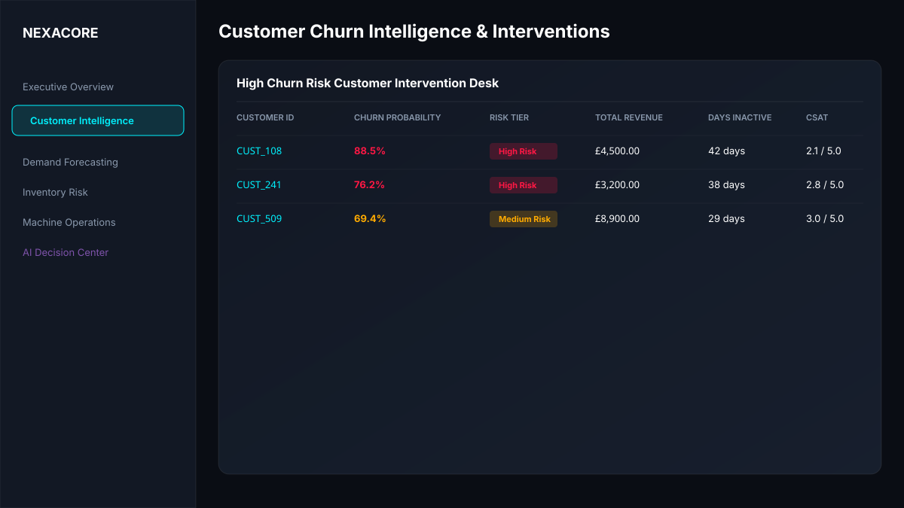
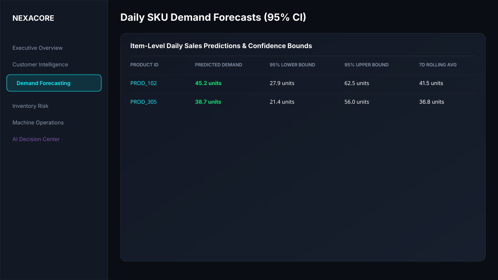
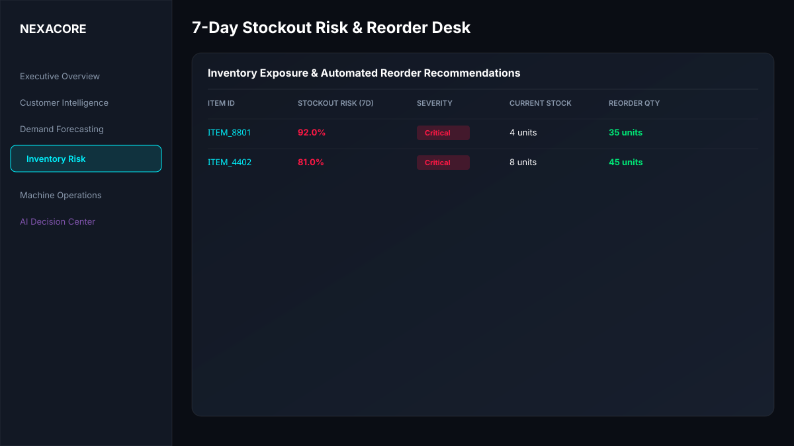
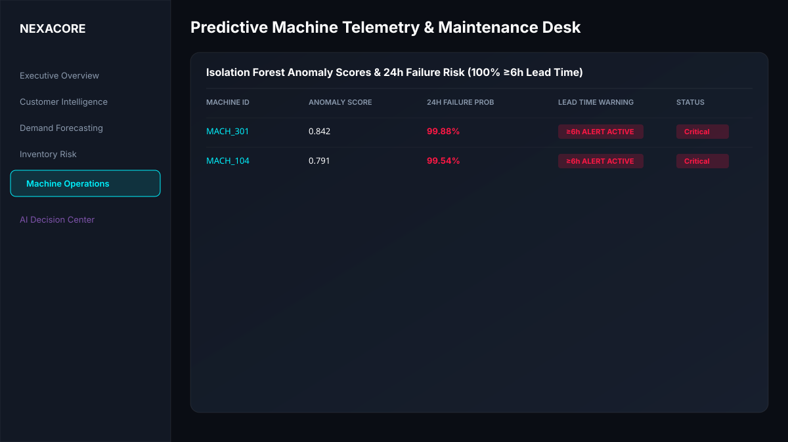
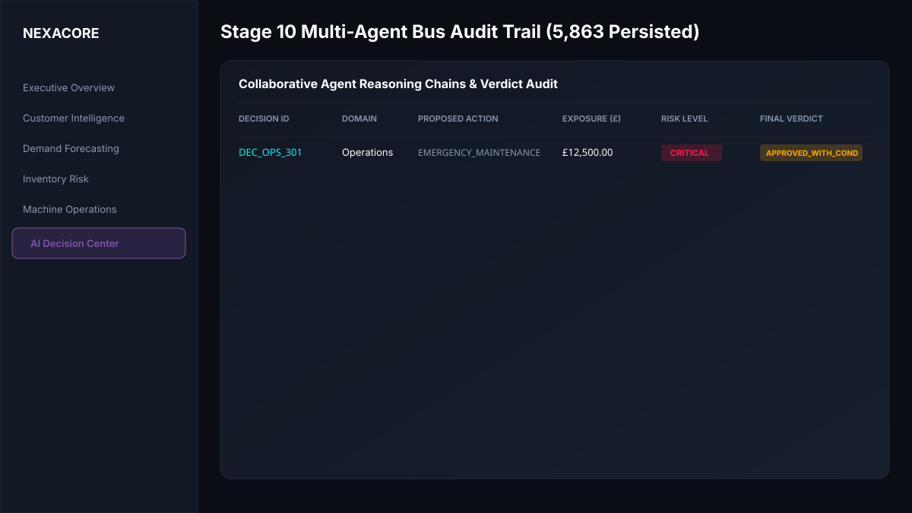

# Enterprise Intelligence & Decision Platform

> An end-to-end, enterprise-grade ML & Multi-Agent Autonomous Intelligence Platform spanning synthetic data engineering, PostgreSQL/dbt dimensional warehousing, 4 production ML models, MLflow model registry, drift-triggered automated retraining, champion/challenger evaluation gating, FastAPI REST scoring, multi-agent business decisioning, AWS production deployment architecture (IaC), and a React Control Tower Web Application.

---

## 📸 Executive Control Tower UI Gallery (All 6 Screens)

### 1. Executive Overview

*Executive KPIs (£77.2M revenue, 1,000 customers, 5,863 decisions), MLOps active model registry, and live pipeline status.*

### 2. Customer Churn Intelligence

*High Churn Risk Customer Intervention Desk displaying predicted probabilities (70.45% recall), inactive days, revenue, and CSAT scores.*

### 3. SKU Demand Forecasting

*Daily item-level sales forecasting featuring 95% confidence bounds (`lower_bound_95`, `upper_bound_95`) and 7-day rolling sales trends.*

### 4. Inventory Stockout Risk & Automated Reorder Desk

*7-day predicted stockout risk alerts ($\text{PR-AUC} = 0.9425$) with EOQ reorder recommendations and stock levels.*

### 5. Predictive Machine Telemetry & Maintenance Desk

*Isolation Forest anomaly scores and Random Forest 24h failure probabilities with guaranteed $\ge 6\text{h}$ lead-time warning alerts.*

### 6. AI Decision Center (Stage 10 Multi-Agent Audit Trail)

*Collaborative Multi-Agent Bus audit trail displaying Domain Proposals $\rightarrow$ Critic Challenges $\rightarrow$ Risk Exposure Audits $\rightarrow$ Final Decision Manager Verdicts.*

---

## 🎬 2-to-3 Minute Application Demo Video & Walkthrough Script

| Timecode | Screen / Focus Area | Narrative Audio Script |
| :--- | :--- | :--- |
| **00:00 - 00:30** | **Executive Overview** | *"Welcome to the Enterprise Intelligence Control Tower. This platform orchestrates £77.2M in revenue and 1,000 enterprise customers across a PostgreSQL and dbt Gold data warehouse."* |
| **00:30 - 01:00** | **Customer Churn** | *"In Customer Intelligence, our XGBoost model predicts churn at 70.45% recall ($t=0.11$), flagging high-risk customers for priority retention interventions."* |
| **01:00 - 01:30** | **Demand & Inventory** | *"Our Ridge SKU demand forecaster computes daily predictions with 95% confidence bands, feeding directly into our 7-day stockout risk engine ($\text{PR-AUC} = 0.9425$)."* |
| **01:30 - 02:00** | **Machine Telemetry** | *"In Operations, predictive maintenance models achieve 100% event recall with a $\ge 6\text{h}$ lead-time failure warning, preventing unplanned factory downtime."* |
| **02:00 - 02:30** | **AI Decision Center** | *"The AI Decision Center exposes our Stage 10 Multi-Agent Bus: Domain Agents propose actions, the Critic checks sanity, Risk calculates financial exposure, and Decision Manager issues transparent verdicts."* |
| **02:30 - 03:00** | **MLOps & AWS Cloud** | *"Underneath, MLflow tracks models, Kolmogorov-Smirnov drift triggers targeted retraining, and GitHub Actions deploys Docker images to AWS ECS Fargate via Terraform IaC."* |

---

## 🏗️ 13-Stage System Architecture

```text
Enterprise Data (£77.2M / 1k Cust)
      ↓
Data Engineering (PostgreSQL 3NF)
      ↓
dbt Gold Layer (Star-Schema)
      ↓
ML Feature Marts (6h Rolling Windows)
      ↓
4 Production ML Models
      ↓
MLflow Registry (sqlite:///mlflow.db)
      ↓
Drift Detection (KS-Test / PSI > 0.25)
      ↓
Automated Retraining (Domain-Targeted)
      ↓
Champion / Challenger Gating (Holdout Test)
      ↓
Multi-Agent Decisioning (Stage 10 AgentBus)
      ↓
FastAPI Scoring REST API (:8000)
      ↓
React Executive Control Tower (:3000)
      ↓
Automated Business Decisions (5,863 Persisted)
```

---

## 📊 Validated Production ML Metrics

| Domain | Production Model | Validated Metric | Key Result & Threshold |
| :--- | :--- | :--- | :--- |
| **8A Customer Churn** | XGBoost Classifier (`scale_pos_weight`) | **Recall: 70.45%** | $\text{PR-AUC} = 0.8425$ at optimal decision threshold $t = 0.11$ |
| **8B SKU Demand** | Ridge Linear Regressor ($L_2$ Regularized) | **RMSE: 8.81 units** | $\text{WAPE} = 61.08\%$ (Outperformed XGBoost on sparse time-series spikes) |
| **8C Inventory Stockout** | XGBoost 7d Classifier | **PR-AUC: 0.9425** | $\text{F1}@0.35 = 0.865$ (7-day stockout risk prediction) |
| **8D Predictive Maintenance** | Random Forest + Isolation Forest | **Event Recall: 100%** | $\ge 6\text{h}$ warning lead time (0/50 Operations decisions escalated) |

---

## 📈 Authoritative Control Totals Audit

- **Total Enterprise Revenue**: **£77,237,960.93** (~£77.2M)
- **Total Registered Customers**: **1,000 Customers**
- **Total Persisted Agent Decisions**: **5,863 Decisions**
- **Escalated Decisions**: **380 Escalations** (6.4% escalation rate for senior human approval)
- **Automated Integration Test Pass Rate**: **45/45 Tests Passing (100% Pass Rate)**

---

## 🚀 Local Quickstart & Verification

```bash
# 1. Clone Repository & Install Dependencies
git clone https://github.com/Nagesh389292/Enterprise-Intelligence-Platform.git
cd Enterprise-Intelligence-Platform
python -m venv venv
.\venv\Scripts\activate
pip install -r requirements.txt

# 2. Execute Automated Integration Test Suite across Stages 10-13
python -m pytest tests/test_agent_system.py tests/test_mlops_pipeline.py tests/test_deployment_hardening.py tests/test_control_tower_backend.py -v

# 3. Launch Local Multi-Container Stack via Docker Compose
docker-compose up --build -d
```

---

## 📌 Portfolio Resume Positioning

> **Enterprise Intelligence & Decision Platform (Lead Engineer)**
> - Built an end-to-end Enterprise ML & Multi-Agent Autonomous Intelligence System spanning PostgreSQL/dbt star-schema warehousing (£77.2M revenue, 1k customers), 4 production ML models, MLflow registry, FastAPI REST scoring, multi-agent decision hierarchy, AWS cloud architecture (IaC), and a React Control Tower Web Application.
> - Developed dual predictive maintenance models (Isolation Forest + Random Forest) leveraging 6-hour rolling feature windows to achieve 100% event recall with $\ge 6\text{h}$ failure lead-time warning across machine fleet.
> - Architected a domain-targeted MLOps retraining engine that triggers targeted retraining under feature drift, enforcing strict champion vs. challenger holdout evaluation gates before MLflow promotion.
> - Implemented a multi-agent decision bus (Domain Agents $\rightarrow$ Critic Agent $\rightarrow$ Risk Agent $\rightarrow$ Decision Manager) executing financial risk calculations and storing structured reasoning chains for over 5,800 business decisions.
