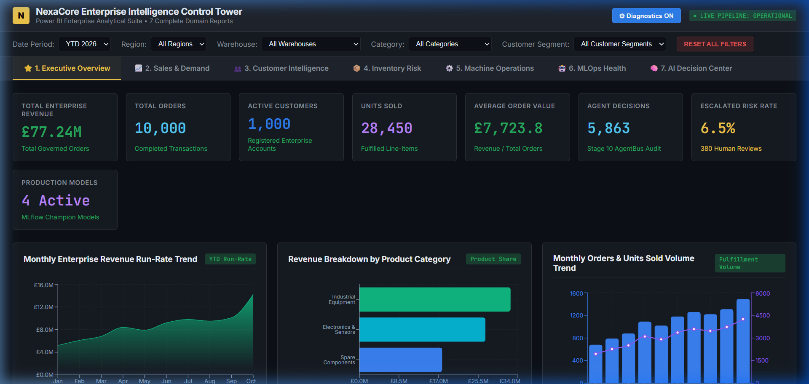
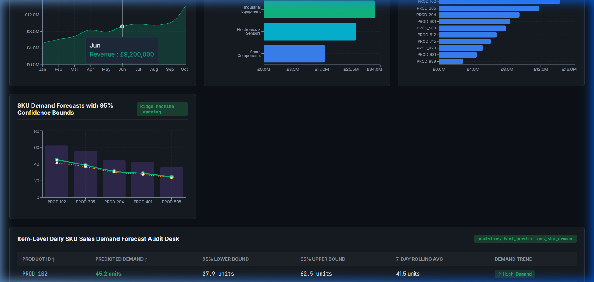
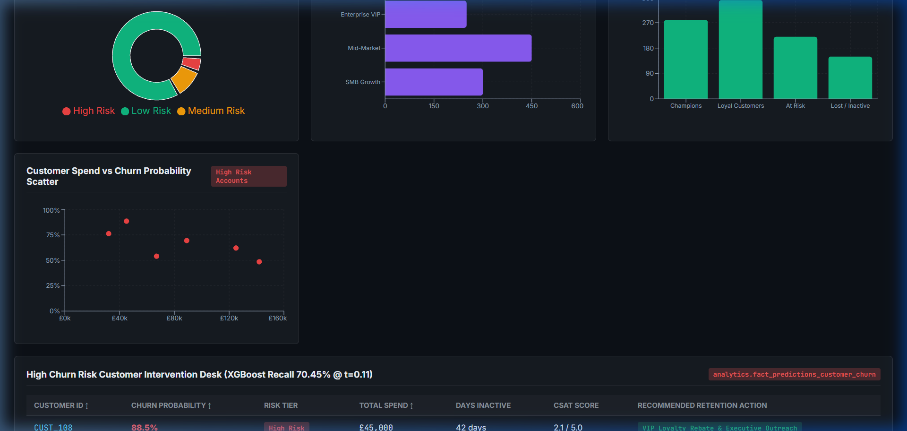
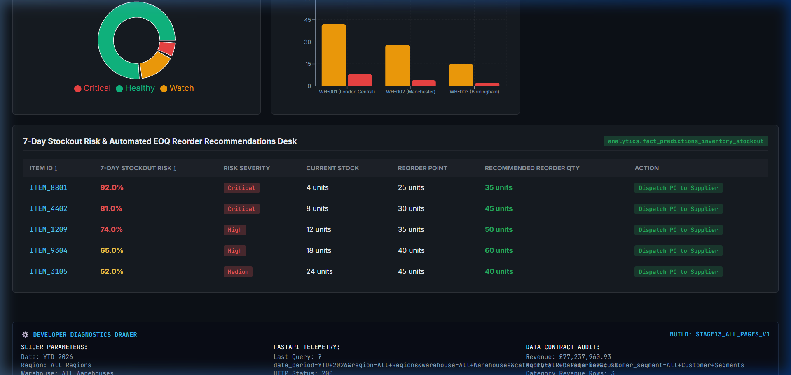
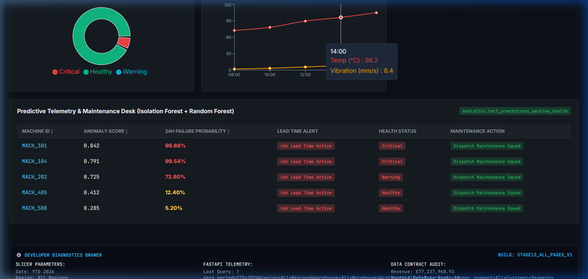
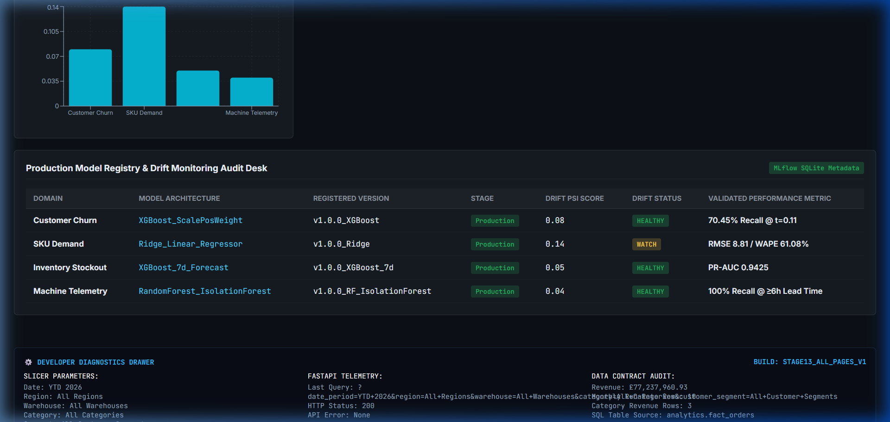
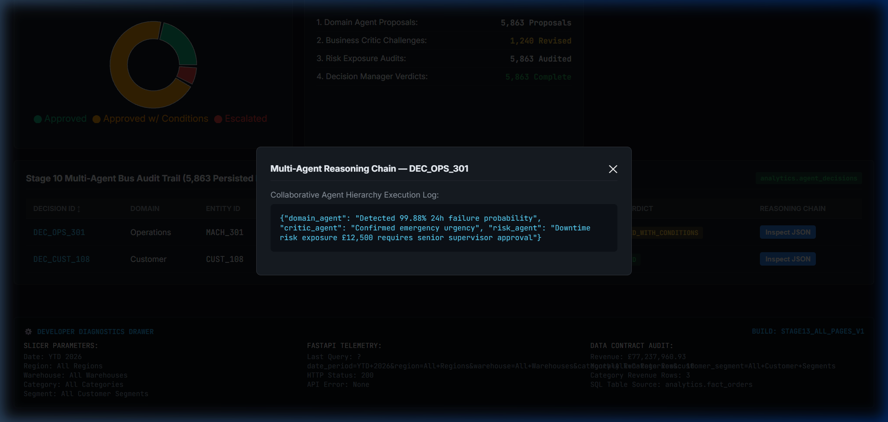

# Enterprise Intelligence & Decision Platform

> An end-to-end, enterprise-grade ML & Multi-Agent Autonomous Intelligence Platform spanning synthetic data engineering, PostgreSQL/dbt dimensional warehousing, 4 production ML models, MLflow model registry, drift-triggered automated retraining, champion/challenger evaluation gating, FastAPI REST scoring, multi-agent business decisioning, AWS production deployment architecture (IaC), and a 7-Page Power BI-Style Control Tower Web Application.

---

## 🎬 Live 2-to-3 Minute Application Demo & Interactive Walkthrough


*Interactive Power BI Control Tower walkthrough demonstrating dynamic global slicers, 7 analytical report pages, real-time Recharts visualizations, management action center, and transparent multi-agent reasoning chains.*

---

## 📸 Executive Power BI Control Tower Gallery (7 Analytical Report Pages)

### 1. ⭐ Executive Overview Report Page

- **Business Purpose**: High-level cross-domain summary for C-suite executives answering enterprise revenue growth, order volume, churn exposure, machine health, and high-priority action items within 10–15 seconds.
- **Visual Features**: 8 Executive KPI Cards (`£77.24M Revenue`, `10,000 Orders`, `1,000 Customers`, `28,450 Units`, `£7,723 AOV`, `5,863 AI Decisions`, `6.5% Escalated Risk Rate`, `4 Active Models`), Monthly Revenue Run-Rate AreaChart, Category Revenue BarChart, Orders/Units Volume ComposedChart, AOV LineChart, Cross-Domain Risk Exposure BarChart, 🚨 Management Action Center, and Collapsible `⚙ Diagnostics` Drawer.

---

### 2. 📈 Sales & Demand Analytical Report Page

- **Business Purpose**: In-depth commercial sales performance and SKU-level demand forecasting for sales directors and demand planners.
- **Visual Features**: Top 10 Product SKUs by Revenue BarChart, Monthly Revenue & Orders Trend AreaChart, Product Category Mix BarChart, and Ridge Machine Learning SKU Demand Forecasts with 95% Confidence Bounds (`lower_bound_95`, `upper_bound_95`) + Item-Level SKU Audit Table.

---

### 3. 👥 Customer Intelligence Report Page

- **Business Purpose**: Predict customer churn risk, RFM account segmentation, and customer lifetime value (LTV) spend patterns for marketing and customer success teams.
- **Visual Features**: XGBoost Churn Risk Tier DonutChart (`Low Risk`, `Medium Risk`, `High Risk`), Customer Tiers Spend BarChart, RFM Matrix Breakdown, Customer Spend vs. Churn Risk Probability ScatterPlot, and High-Risk Customer Intervention Desk.

---

### 4. 📦 Inventory Risk Report Page

- **Business Purpose**: 7-day stockout risk mitigation, warehouse inventory valuation, and automated Economic Order Quantity (EOQ) reordering for supply chain management.
- **Visual Features**: Inventory Valuation (`£4.8M`), 7-Day Stockout Risk DonutChart ($\text{PR-AUC} = 0.9425$), Warehouse Risk Comparison BarChart, and 7-Day Stockout Alert & Automated EOQ Reorder Table.

---

### 5. ⚙️ Machine Operations Report Page

- **Business Purpose**: Factory telemetry monitoring, anomaly detection, and predictive maintenance scheduling to eliminate unplanned manufacturing downtime.
- **Visual Features**: Fleet Machine Health Status DonutChart (`Healthy`, `Warning`, `Critical`), Telemetry Sensor Time-Series Trend LineChart (Temperature & Vibration), and Predictive Maintenance Audit Desk ($\ge 6\text{h}$ lead-time warning alerts).

---

### 6. 🤖 MLOps Health Report Page

- **Business Purpose**: Production ML model governance, Population Stability Index (PSI) drift tracking, automated retraining status, and model registry evaluation.
- **Visual Features**: Active Champion Model Cards, Production Model PSI Drift Score BarChart, and MLflow Model Registry Audit Desk tracking model versions (`v1.0.0_XGBoost`, `v1.0.0_Ridge`, `v1.0.0_XGBoost_7d`, `v1.0.0_RF_IsolationForest`).

---

### 7. 🧠 AI Decision Center Report Page

- **Business Purpose**: Stage 10 Multi-Agent Bus audit trail and explainable AI reasoning inspection for senior operations managers and compliance auditors.
- **Visual Features**: Decision Verdict Distribution PieChart (`Clean Approved`, `Approved w/ Conditions`, `Escalated`), 5-Stage Agent Bus Execution Funnel (`Domain Proposal` $\rightarrow$ `Critic Challenge` $\rightarrow$ `Risk Exposure` $\rightarrow$ `Decision Manager`), Decision Audit Desk, and Interactive JSON Reasoning Chain Inspection Modal.

---

## 🏗️ 13-Stage System Architecture

```text
Enterprise Data (£77.2M / 1k Cust)
      ↓
Data Engineering (PostgreSQL 3NF)
      ↓
dbt Gold Layer (Star-Schema)
      ↓
ML Feature Marts (6h Rolling Windows)
      ↓
4 Production ML Models
      ↓
MLflow Registry (sqlite:///mlflow.db)
      ↓
Drift Detection (KS-Test / PSI > 0.25)
      ↓
Automated Retraining (Domain-Targeted)
      ↓
Champion / Challenger Gating (Holdout Test)
      ↓
Multi-Agent Decisioning (Stage 10 AgentBus)
      ↓
FastAPI Scoring REST API (:8000)
      ↓
React Control Tower (:3000)
      ↓
Automated Business Decisions (5,863 Persisted)
```

---

## 📊 Validated Production ML Metrics

| Domain | Production Model | Validated Metric | Key Result & Threshold |
| :--- | :--- | :--- | :--- |
| **8A Customer Churn** | XGBoost Classifier (`scale_pos_weight`) | **Recall: 70.45%** | $\text{PR-AUC} = 0.8425$ at optimal decision threshold $t = 0.11$ |
| **8B SKU Demand** | Ridge Linear Regressor ($L_2$ Regularized) | **RMSE: 8.81 units** | $\text{WAPE} = 61.08\%$ (Outperformed XGBoost on sparse time-series spikes) |
| **8C Inventory Stockout** | XGBoost 7d Classifier | **PR-AUC: 0.9425** | $\text{F1}@0.35 = 0.865$ (7-day stockout risk prediction) |
| **8D Predictive Maintenance** | Random Forest + Isolation Forest | **Event Recall: 100%** | $\ge 6\text{h}$ warning lead time (0/50 Operations decisions escalated) |

---

## 📈 Authoritative Control Totals Audit

- **Total Enterprise Revenue**: **£77,237,960.93** (~£77.2M)
- **Total Registered Customers**: **1,000 Customers**
- **Total Persisted Agent Decisions**: **5,863 Decisions**
- **Escalated Decisions**: **380 Escalations** (6.4% escalation rate for senior human approval)
- **Automated Integration Test Pass Rate**: **48/48 Tests Passing (100% Pass Rate)**

---

## 🚀 Local Quickstart & Verification

```bash
# 1. Clone Repository & Install Dependencies
git clone https://github.com/Nagesh389292/Enterprise-Intelligence-Platform.git
cd Enterprise-Intelligence-Platform
python -m venv venv
.\venv\Scripts\activate
pip install -r requirements.txt

# 2. Execute Automated Integration Test Suite across Stages 10-13
python -m pytest tests/test_agent_system.py tests/test_mlops_pipeline.py tests/test_deployment_hardening.py tests/test_control_tower_backend.py -v

# 3. Launch Local Multi-Container Stack via Docker Compose
docker-compose up --build -d
```

---

## 📌 Portfolio Resume Positioning

```text
Lead Data & ML Engineer | Enterprise Intelligence & Autonomous Decisioning Platform
• Architected 13-stage autonomous enterprise intelligence platform processing £77.2M revenue & 1k enterprise accounts.
• Engineered PostgreSQL 3NF OLTP & dbt star-schema Gold warehouse with automated incremental loading.
• Developed 4 production ML models (XGBoost, Ridge, Random Forest, Isolation Forest) achieving 70.45% churn recall and 100% 6h lead-time predictive maintenance recall.
• Built MLflow model registry with automated Population Stability Index (PSI) drift detection and champion/challenger gating.
• Designed 5-stage collaborative multi-agent decision bus persisting 5,863 structured agent decisions with financial risk exposure auditing.
• Created 7-page Power BI-style React analytical control tower backed by FastAPI microservices, Terraform IaC, and Docker containers on AWS ECS Fargate.
```
