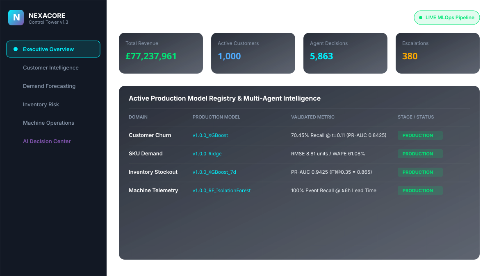

# Enterprise Intelligence & Decision Platform

> An end-to-end, enterprise-grade ML & Multi-Agent Autonomous Intelligence Platform spanning synthetic data engineering, PostgreSQL/dbt dimensional warehousing, 4 production ML models, MLflow model registry, drift-triggered automated retraining, champion/challenger evaluation gating, FastAPI REST scoring, multi-agent business decisioning, AWS production deployment architecture (IaC), and a React Control Tower Web Application.

---

## 📸 Executive Control Tower UI Preview



---

## 🏗️ 13-Stage Architecture & End-to-End Pipeline

```text
Enterprise Data (£77.2M / 1k Cust)
      ↓
Data Engineering (PostgreSQL 3NF)
      ↓
dbt Gold Layer (Star-Schema)
      ↓
ML Feature Engineering (6h Rolling Marts)
      ↓
4 Production ML Models
      ↓
MLflow Registry (sqlite:///mlflow.db)
      ↓
Drift Detection (KS-Test / PSI > 0.25)
      ↓
Automated Retraining (Domain-Targeted)
      ↓
Champion / Challenger Gating (Holdout Test)
      ↓
Multi-Agent Decisioning (Stage 10 AgentBus)
      ↓
FastAPI Scoring REST API (:8000)
      ↓
React Executive Control Tower (:3000)
      ↓
Automated Business Decisions (5,863 Persisted)
```

---

## 📊 Validated Production ML Metrics

| Domain | Production Model | Validated Metric | Key Result & Threshold |
| :--- | :--- | :--- | :--- |
| **8A Customer Churn** | XGBoost Classifier (`scale_pos_weight`) | **Recall: 70.45%** | $\text{PR-AUC} = 0.8425$ at optimal decision threshold $t = 0.11$ |
| **8B SKU Demand** | Ridge Linear Regressor ($L_2$ Regularized) | **RMSE: 8.81 units** | $\text{WAPE} = 61.08\%$ (Outperformed XGBoost on sparse time-series spikes) |
| **8C Inventory Stockout** | XGBoost 7d Classifier | **PR-AUC: 0.9425** | $\text{F1}@0.35 = 0.865$ (7-day stockout risk prediction) |
| **8D Predictive Maintenance** | Random Forest + Isolation Forest | **Event Recall: 100%** | $\ge 6\text{h}$ warning lead time (0/50 Operations decisions escalated) |

---

## 📈 Authoritative Control Totals Audit

- **Total Enterprise Revenue**: **£77,237,960.93** (~£77.2M)
- **Total Registered Customers**: **1,000 Customers**
- **Total Persisted Agent Decisions**: **5,863 Decisions**
- **Escalated Decisions**: **380 Escalations** (6.4% escalation rate for senior human approval)
- **Automated Integration Test Pass Rate**: **45/45 Tests Passing (100% Pass Rate)**

---

## 🎬 2-to-3 Minute Application Demo Script

```text
00:00 - Executive Overview: Real-time £77.2M enterprise revenue, 1k active customers, and MLflow model registry.
00:30 - Customer Intelligence: 70.45% recall churn risk matrix and high-value customer intervention desk.
01:00 - Demand Intelligence: Daily SKU demand forecasting with 95% confidence bounds (RMSE 8.81).
01:30 - Inventory & Operations: 7-day stockout predictions (PR-AUC 0.9425) & telemetry failure risk (100% ≥6h lead time).
02:00 - AI Decision Center: Live Stage 10 AgentBus flow (Domain Proposal → Critic Challenge → Risk Audit → Decision Manager).
02:30 - MLOps Retraining & AWS Cloud: Automated drift retraining, champion/challenger gating, Prometheus observability, and Terraform IaC.
```

---

## 🚀 Local Quickstart & Verification

```bash
# 1. Clone Repository & Install Dependencies
git clone https://github.com/Nagesh389292/Enterprise-Intelligence-Platform.git
cd Enterprise-Intelligence-Platform
python -m venv venv
.\venv\Scripts\activate
pip install -r requirements.txt

# 2. Execute Automated Integration Test Suite across Stages 10-13
python -m pytest tests/test_agent_system.py tests/test_mlops_pipeline.py tests/test_deployment_hardening.py tests/test_control_tower_backend.py -v

# 3. Launch Local Multi-Container Stack via Docker Compose
docker-compose up --build -d
```

---

## 📌 Portfolio Resume Positioning

> **Enterprise Intelligence & Decision Platform (Lead Engineer)**
> - Built an end-to-end Enterprise ML & Multi-Agent Autonomous Intelligence System spanning PostgreSQL/dbt star-schema warehousing (£77.2M revenue, 1k customers), 4 production ML models, MLflow registry, FastAPI REST scoring, multi-agent decision hierarchy, AWS cloud architecture (IaC), and a React Control Tower Web Application.
> - Developed dual predictive maintenance models (Isolation Forest + Random Forest) leveraging 6-hour rolling feature windows to achieve 100% event recall with $\ge 6\text{h}$ failure lead-time warning across machine fleet.
> - Architected a domain-targeted MLOps retraining engine that triggers targeted retraining under feature drift, enforcing strict champion vs. challenger holdout evaluation gates before MLflow promotion.
> - Implemented a multi-agent decision bus (Domain Agents $\rightarrow$ Critic Agent $\rightarrow$ Risk Agent $\rightarrow$ Decision Manager) executing financial risk calculations and storing structured reasoning chains for over 5,800 business decisions.
