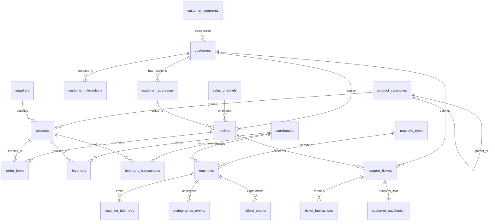
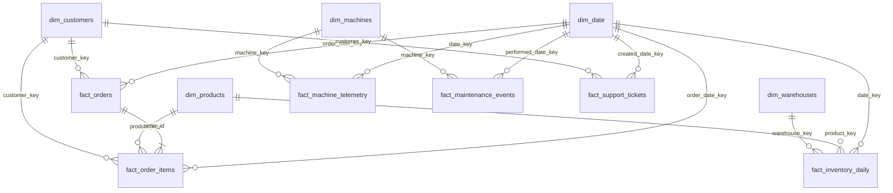

# Entity Relationships & Data Model Diagrams
### NexaCore Enterprise Intelligence Platform

This document presents the complete relationship specifications, cardinalities, parent-child dependencies, and **Mermaid ER Diagrams** for both the **3NF Source System** and the **Gold Layer Analytical Star Schema**.

---

## 1. Source System (3NF) Entity Relationships & Cardinalities

### 1.1 Summary Matrix

| Parent Entity | Child Entity | Foreign Key | Cardinality | Business Constraint / Rule |
| :--- | :--- | :--- | :--- | :--- |
| `customer_segments` | `customers` | `segment_id` | **1 : N** | Mandatory segment assignment per customer |
| `customers` | `customer_addresses` | `customer_id` | **1 : N** | Customer must have at least 1 primary address |
| `customers` | `customer_interactions`| `customer_id` | **1 : N** | Optional interaction logs |
| `customers` | `orders` | `customer_id` | **1 : N** | Customer places 0 to many orders |
| `sales_channels` | `orders` | `channel_id` | **1 : N** | Order originates from 1 channel |
| `customer_addresses` | `orders` | `shipping_address_id`| **1 : N** | Order ships to 1 customer address |
| `orders` | `order_items` | `order_id` | **1 : N** | Order contains 1 to many order line items |
| `product_categories` | `product_categories` | `parent_category_id`| **1 : N** | Optional self-referencing category tree |
| `product_categories` | `products` | `category_id` | **1 : N** | Product belongs to 1 category |
| `products` | `order_items` | `product_id` | **1 : N** | Product ordered in line items |
| `warehouses` | `inventory` | `warehouse_id` | **1 : N** | Facility holds inventory for multiple products |
| `products` | `inventory` | `product_id` | **1 : N** | Product stocked across facilities |
| `warehouses` | `inventory_transactions`| `warehouse_id` | **1 : N** | Facility records inventory movements |
| `products` | `inventory_transactions`| `product_id` | **1 : N** | Product records inventory movements |
| `machine_types` | `machines` | `machine_type_id` | **1 : N** | Machine assigned to 1 equipment type |
| `warehouses` | `machines` | `warehouse_id` | **1 : N** | Machine installed in 1 warehouse/factory site |
| `machines` | `machine_telemetry` | `machine_id` | **1 : N** | Machine streams high-frequency telemetry |
| `machines` | `maintenance_events` | `machine_id` | **1 : N** | Machine undergoes maintenance events |
| `machines` | `failure_events` | `machine_id` | **1 : N** | Machine records failure incidents |
| `customers` | `support_tickets` | `customer_id` | **1 : N** | Customer files 0 to many support tickets |
| `orders` | `support_tickets` | `order_id` | **1 : N** | Optional linked order for ticket |
| `support_tickets` | `ticket_interactions` | `ticket_id` | **1 : N** | Ticket thread contains interaction messages |
| `support_tickets` | `customer_satisfaction`| `ticket_id` | **1 : 1** | Strict 1:1 survey response per ticket |

---

### 1.2 3NF Source System Mermaid ER Diagram



---

## 2. Analytical Star Schema Relationships

### 2.1 Star Schema Architecture Matrix

In the analytical DW (Gold Layer), all Fact tables maintain explicit **N : 1** relationships pointing to single Dimension tables via Integer Surrogate Keys (`customer_key`, `product_key`, `date_key`, etc.).

```text
               ┌────────────────┐
               │  dim_customers │
               └───────┬────────┘
                       │ 1
                       │
                       │ N
               ┌───────▼────────┐
               │  fact_orders   │
               └───────▲────────┘
                       │ N
                       │
                       │ 1
               ┌───────┴────────┐
               │   dim_date     │
               └────────────────┘
```

---

### 2.2 Analytical Star Schema Mermaid Diagram


